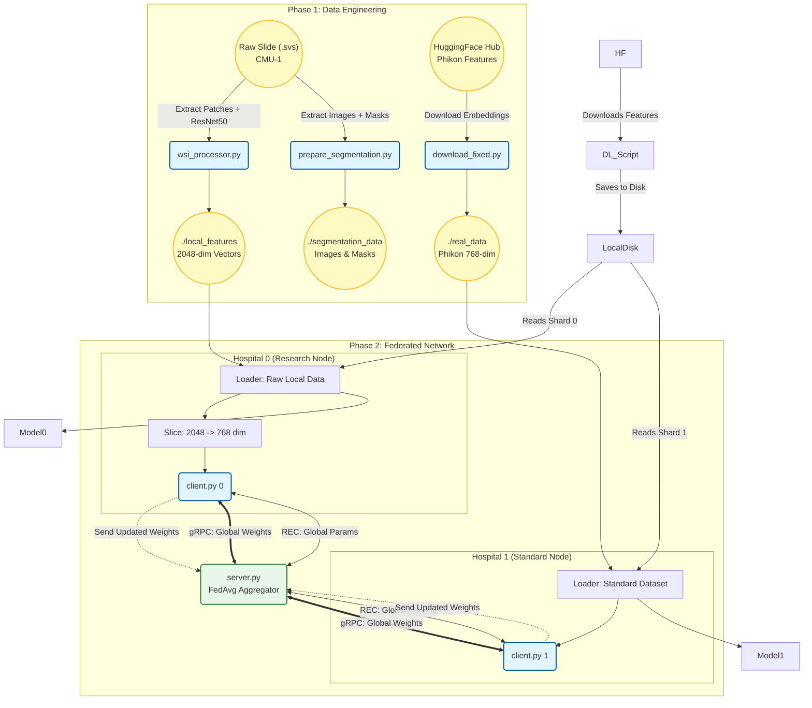

# Federated Learning for Digital Pathology (Classification & Segmentation)

This project implements a comprehensive **Federated Learning (FL)** framework for **Digital Pathology**. It demonstrates a multi-task pipeline capable of handling **heterogeneous data sources** (Raw WSI processing vs. Pre-computed features) and performing both **Slide-Level Classification** and **Semantic Segmentation**.

---

## 🔬 Medical Data & Tasks

### 🧪 Task 1: WSI Classification (Metastasis Detection)
**Goal:** Detect breast cancer metastasis in lymph nodes  
**Method:** Attention-based Multiple Instance Learning (MIL)

**Data Handling (Heterogeneous):**
| Hospital | Type | Data Format | Processing |
|----------|------|-------------|------------|
| A (Research) | Raw WSI | .svs Gigapixel Slides | Custom ResNet50 feature extraction |
| B (Standard) | Pre-computed | Phikon ViT embeddings (768-dim) | Direct feature loading |

---

### 🧬 Task 2: Semantic Segmentation (Tissue Detection)
**Goal:** Pixel-wise segmentation of tissue vs. background  
**Method:** U-Net trained on 256×256 image patches  
**Data:** Synthetic ground truth masks generated using HSV thresholding

| Attribute | Description |
|-----------|-------------|
| Dataset | Camelyon16 & CMU-1 (OpenSlide Test Data) |
| Modality | Histopathology (H&E Stained Whole Slide Images) |
| Scale | Gigapixel WSIs (46,000+ pixels width) |
| Privacy | Data remains local; only model weights are shared via gRPC |

---

## 🏗 Technical Architecture

### 🔄 System Workflow (Mermaid Diagram)




##  How to Run

### Install Dependencies
```bash
pip install torch torchvision flwr datasets huggingface_hub
````

---

### 1️⃣ Download & Prepare Data

```bash
python download_.py
```

---

### 2️⃣ Start the Federated Server

```bash
python server.py
```

---

### 3️⃣ Start Federated Clients (Hospitals) for example: 2 hospitals

```bash
# Terminal 2 - Hospital 0
python client.py 0

# Terminal 3 - Hospital 1
python client.py 1
```

