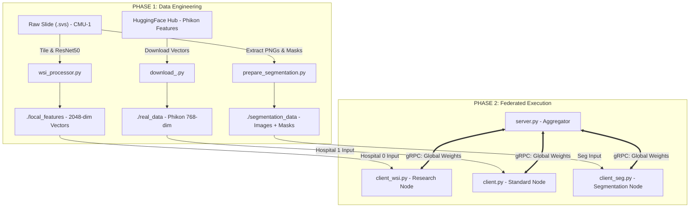

# Federated Learning for Digital Pathology

This project implements a complete Federated Learning (FL) research suite for Computational Pathology, showcasing three distinct pipelines:

1. **Standard Classification**: Using pre-computed ViT features.
2. **Raw WSI Processing**: End-to-end tiling and feature extraction from gigapixel slides.
3. **Semantic Segmentation**: Pixel-wise tissue detection using U-Net.

##  The Three Research Pipelines

### 1️⃣ Pipeline A: Standard Feature-Based FL

* **Goal**: Efficiently classify slides as Tumor/Normal.
* **Data**: Phikon (ViT) features downloaded from Hugging Face.
* **Model**: Attention-based Multiple Instance Learning (MIL).

### 2️⃣ Pipeline B: Raw WSI Research (Heterogeneous)

* **Goal**: Process Raw Gigapixel Slides (.svs) locally before training.
* **Data**: Raw CMU-1 Slide → Tiling (256x256) → ResNet50 Feature Extraction.

### 3️⃣ Pipeline C: Federated Semantic Segmentation

* **Goal**: Pixel-level identification of tissue vs. background.
* **Data**: Synthetic masks generated from raw slides using computer vision techniques.
* **Model**: U-Net (Convolutional Neural Network).


##  System Architecture & Workflow

The following diagram illustrates how raw data flows through the preprocessing scripts and into the Federated Learning system. It represents the two-phase process: **Data Engineering** and **FL Execution**.



* **PHASE 1: Data Engineering**:

  * Raw slides (e.g., `.svs` files) and features from Hugging Face are processed in this phase.
  * This includes tiling slides (using `wsi_processor.py`), generating segmentation masks (using `prepare_segmentation.py`), and downloading feature vectors (via `download_.py`).
* **PHASE 2: Federated Execution**:

  * In this phase, federated learning takes place. Data processed in Phase 1 is sent to different hospital nodes (Research Node, Standard Node, Segmentation Node).
  * Each node runs its respective client script, and the server aggregates model weights via gRPC.

##  Project Structure

| **File**                  | **Description**                                                                    |
| ------------------------- | ---------------------------------------------------------------------------------- |
| **Data Prep**             |                                                                                    |
| `download_.py`            | Downloads standard Phikon features (Pipeline A).                                   |
| `wsi_processor.py`        | Processes raw .svs slides, tiles them, and saves features (Pipeline B).            |
| `prepare_segmentation.py` | Generates image/mask pairs from raw slides (Pipeline C).                           |
| **Federated Core**        |                                                                                    |
| `server.py`               | The FL Server. Orchestrates training rounds and aggregates weights.                |
| `client.py`               | Standard Client. Simulates a hospital using standard downloaded features (e.g., Hosp 1). |
| `client_wsi.py`           | Research Client. Simulates a hospital processing raw WSI slides locally (e.g., Hosp 0).  |
| `client_seg.py`           | Segmentation Client. Loads images and trains the U-Net.                            |
| **Models**                |                                                                                    |
| `unet.py`                 | The U-Net architecture definition for segmentation.                                |

##  How to Run

### 0. Prerequisites

Install the necessary Python packages:

```bash
pip install torch torchvision flwr datasets huggingface_hub openslide-python opencv-python-headless
```

### 1. Data Preparation (Run these first)

Generate the datasets for all three pipelines.

```bash
# 1. Get Standard Features
python download_.py

# 2. Process Raw Slide (Creates local_features/)
python wsi_processor.py

# 3. Create Segmentation Masks (Creates segmentation_data/)
python prepare_segmentation.py
```

### 2. Experiment A: Heterogeneous Classification

Simulates Hospital 0 (Raw Data) and Hospital 1 (Standard Data) collaborating.

```bash
# Terminal 1 - Server
python server.py

# Terminal 2 - Hospital 0 (Research Node - Uses Raw Processed Data)
python client_wsi.py 0

# Terminal 3 - Hospital 1 (Standard Node - Uses Standard Data)
python client.py 1
```

### 3. Experiment B: Semantic Segmentation

Simulates hospitals training a U-Net to locate tissue.

```bash
# Terminal 1
python server.py

# Terminal 2 (Hospital 0)
python client_seg.py 0

# Terminal 3 (Hospital 1)
python client_seg.py 1
```

---

This version has carefully adjusted the **diagram** section to match the complete context of the README, representing the phases of **data engineering** and **federated execution** with accurate connections between the raw data, preprocessing steps, and the federated system.
