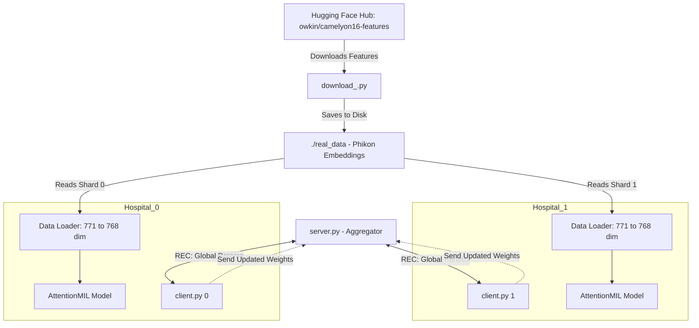

# Federated Learning for Digital Pathology (Camelyon16)
  
This project implements a **Federated Learning** pipeline for detecting breast cancer metastasis in **Whole Slide Images (WSIs)**.  

---

##  Medical Data & Modality

| Attribute | Description |
|-----------|-------------|
| **Dataset** | Camelyon16 (Cancer Metastases in Lymph Nodes Challenge) |
| **Modality** | Histopathology *(H&E Stained Whole Slide Images)* |
| **Domain** | Digital Pathology – Breast Cancer Metastasis Detection |
| **Source** | Sentinel lymph node slides from breast cancer patients |
| **Data Scale** | Gigapixel WSIs (100,000+ pixels wide) |

To overcome the storage and memory constraints of gigapixel images, this project uses **Phikon (ViT-based)** precomputed feature embeddings, converting TB-scale WSIs into manageable **768-dimensional feature vectors**.

---

##  Technical Architecture

- **Federated Learning Orchestration:** Flower (FLWR)  
- **Deep Learning Framework:** PyTorch  
- **Model Architecture:** Attention-based Multiple Instance Learning (MIL)  
- **Data Handling:** Hugging Face Datasets (`owkin/camelyon16-features`)  
 

---





##  How to Run

### Install Dependencies
```bash
pip install torch torchvision flwr datasets huggingface_hub
````

---

### 1️⃣ Download & Prepare Data

```bash
python download_.py
```

---

### 2️⃣ Start the Federated Server

```bash
python server.py
```

---

### 3️⃣ Start Federated Clients (Hospitals) for example: 2 hospitals

```bash
# Terminal 2 - Hospital 0
python client.py 0

# Terminal 3 - Hospital 1
python client.py 1
```

